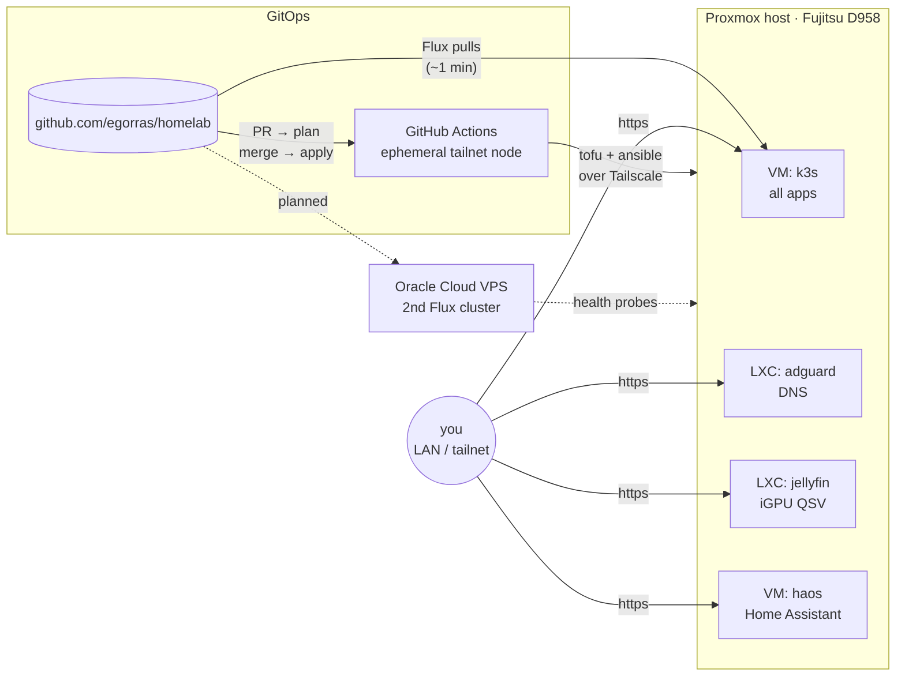

<div align="center">

# 🏠 homelab

Single-node home lab defined entirely in this repo: **push to `main` → it's deployed.**

[](https://github.com/egorras/homelab/actions/workflows/lint.yml)
[](https://github.com/egorras/homelab/actions/workflows/infra.yml)
[](renovate.json)
[](https://github.com/egorras/homelab/commits/main)

[](https://www.proxmox.com)
[](https://k3s.io)
[](https://fluxcd.io)
[](https://opentofu.org)
[](https://www.ansible.com)
[](https://getsops.io)
[](https://tailscale.com)

</div>

## ✨ How it works

| Layer | Tooling | Deployed by |
|---|---|---|
| Hypervisor (Proxmox VE) | automated install (`answer.toml`) + Ansible | one-time bootstrap, then CI |
| VMs & LXCs | OpenTofu (`bpg/proxmox`) + Ansible | GitHub Actions over Tailscale |
| Apps | Kubernetes (k3s) + Flux | Flux pulls from git |
| Secrets | SOPS + age | decrypted in-cluster / in CI |



AdGuard and Jellyfin live outside the cluster on purpose ([ADR 0002](docs/adr/0002-services-outside-the-cluster.md)).

## 🧩 Services

Everything's reachable over LAN / tailnet only, behind a wildcard subdomain with a Let's Encrypt cert
(DNS-01 via Cloudflare). Alerts go to Telegram.

**Media**

| | Service | Runs on |
|---|---|---|
|  | Jellyseerr (requests → Sonarr/Radarr) | k3s |
|  | Sonarr (TV) | k3s |
|  | Radarr (movies) | k3s |
|  | Prowlarr (indexers) | k3s |
|  | qBittorrent (behind PIA VPN) | k3s |
|  | Pinchflat (YouTube → Jellyfin) | k3s |
|  | Jellyfin | LXC |

**Photos**

| | Service | Runs on |
|---|---|---|
|  | Immich | k3s |

**Home**

| | Service | Runs on |
|---|---|---|
|  | Home Assistant | VM (HAOS) |
|  | AdGuard Home | LXC |

**Platform**

| | Service | Runs on |
|---|---|---|
|  | Homepage | k3s |
|  | Grafana + VictoriaMetrics | k3s |
|  | Headlamp | k3s |
| 🗺️ | Homelable (network map) | k3s |
|  | Proxmox VE | bare metal |

## 🖥️ Hardware

| Host | Specs |
|---|---|
| Fujitsu Esprimo D958 SFF | i5-8500 (UHD 630 Quick Sync), 24 GB RAM, 256 GB NVMe, 4 TB HDD |
| Oracle Cloud A1.Flex | 2 OCPU / 12 GB, arm64 (Always Free) |

## 📁 Layout

```
metal/        proxmox install, ansible roles, opentofu, tailnet policy
kubernetes/   clusters/, infrastructure/, apps/  (one folder per app, apps/_template to start)
docs/         adr/ (decisions), runbooks/
```

## 🚀 Getting started

```sh
make tools      # pinned toolchain via mise (or open the devcontainer)
make lint       # same checks as CI, including gitleaks
make check      # dry run: ansible --check --diff + tofu plan
make help       # everything else
```

New app → copy `kubernetes/apps/_template` ([runbook](docs/runbooks/new-app.md)).

## 🔐 Public-repo hygiene

Everything secret is SOPS-encrypted (tofu state too, [ADR 0004](docs/adr/0004-encrypted-tofu-state-in-git.md)).
gitleaks runs in pre-commit and CI, actions are pinned by SHA, fork PRs get no secrets, and CI reaches the
lab only as an ephemeral, ACL-limited Tailscale node ([ADR 0003](docs/adr/0003-ci-access-over-tailscale.md)).

## 📚 Docs

[Decisions (ADRs)](docs/adr) · [Runbooks](docs/runbooks)
